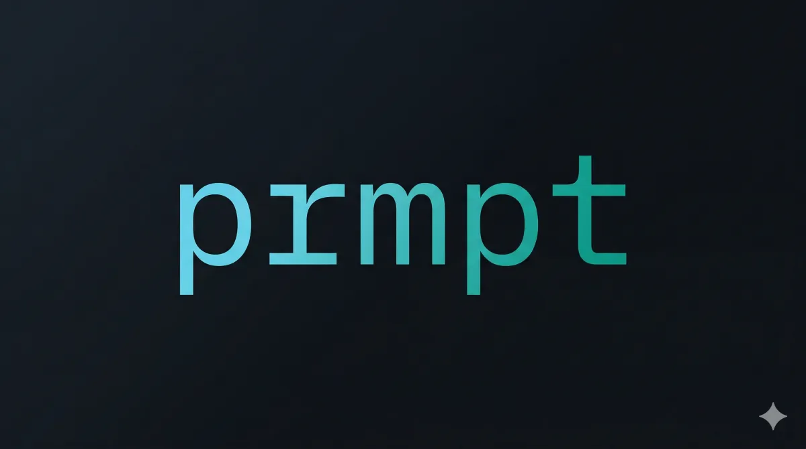
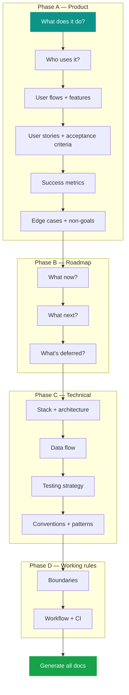

One command to set up any project for AI-first development with Claude Code.

```bash
npx github:[org]/prmpt
```

## How it works


## The interview

The `project-setup` skill isn't a survey. It's a collaborative design session:



- **Problem first, tools last** — understands WHAT you're building before asking about HOW
- **Pushes back** — challenges decisions, predicts edge cases you haven't considered
- **One question at a time** — concrete options with a recommendation
- **Never infers preferences** — reads facts from code, asks about every decision

## What you get

```
your-project/
├── CLAUDE.md                         → Points Claude to AGENTS.md every session
├── AGENTS.md                         → Lean project reference (~80 lines)
├── docs/ai/
│   ├── PRODUCT.md                    → User stories, acceptance criteria, success metrics
│   ├── ROADMAP.md                    → Priorities, phases, constraints
│   ├── CONVENTIONS.md                → Naming, imports, code style
│   ├── PATTERNS.md                   → Component/module structure
│   ├── TESTING.md                    → What to test, how, philosophy
│   └── ARCHITECTURE.md              → Stack, schema, data flow, decisions
├── .claude/
│   ├── settings.json                 → Plugin config + permissions
│   └── skills/project-setup/SKILL.md → The interview skill
└── .github/                          → CI + AI PR review (tailored to your stack)
```

## Plugins

Six plugins installed automatically:

| Plugin | What it does |
|---|---|
| **superpowers** | Dev workflow: brainstorm, plan, TDD, code review, PR |
| **context7** | Fresh docs for any library — even ones you know well |
| **github** | Repo management, issues, PRs from Claude |
| **commit-commands** | Git commit/push workflows |
| **figma** | Access design files directly |
| **claude-code-setup** | Codebase analysis and recommendations |

After the interview, a **plugin audit** suggests stack-specific plugins (LSP for your language, Supabase, Playwright, etc.) and installs them.

## After setup

```mermaid
graph LR
    A[/using-superpowers] --> B[brainstorm]
    B --> C[write-plan]
    C --> D[execute-plan]
    D --> E[code-review]
    E --> F[finish branch]

    style A fill:#0d9488,color:#fff,stroke:none
    style F fill:#16a34a,color:#fff,stroke:none
```

## Updating

```bash
npx github:[org]/prmpt update
```

Updates skill and config files. Never overwrites your AGENTS.md or docs/ai/ without asking.

## Requirements

- Node.js >= 18
- [Claude Code](https://docs.anthropic.com/en/docs/claude-code)

---

<sub>Zero LLM API calls. All intelligence comes from Claude Code + the bundled project-setup skill.</sub>
